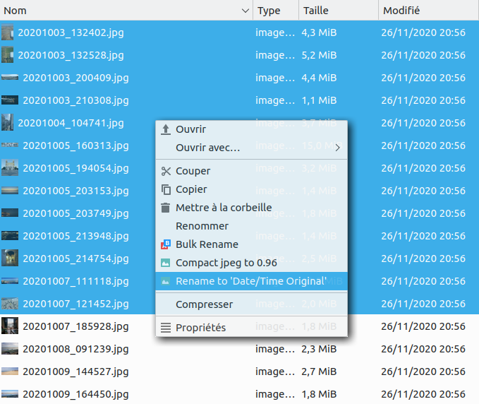
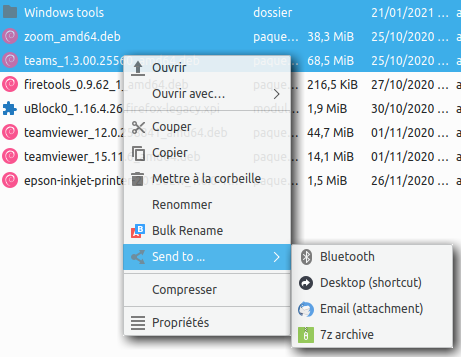

# PCManFM-Qt (and GNOME Nautilus) Context Menu

**Various context menus (i.e. right click menus aka** *custom actions* **) for LXQt's file manager ... also should work with Nautilus under GNOME.**

**Create your own (!) actions to speed up repetitive tasks or terminal commands, or simply extend your file manager with what you really need.**

Great Linux distribution: https://lxqt.org/ or https://lubuntu.me/ (which use PCManFM-Qt as file manager)

Copyright © 2020 Andrew Jackson (https://github.com/ceever ... ceever@web.de)

This program is free software; you can redistribute it and/or modify it under the terms of the GNU General Public License as published by the Free Software Foundation; either version 2 of the License, or (at your option) any later version.

This program is distributed in the hope that it will be useful, but WITHOUT ANY WARRANTY; without even the implied warranty of MERCHANTABILITY or FITNESS FOR A PARTICULAR PURPOSE. See the GNU General Public License for more details.

You should have received a copy of the GNU General Public License along with this program; if not, write to the Free Software Foundation, Inc., 51 Franklin Street, Fifth Floor, Boston MA 02110-1301, USA.

---
**SCREENSHOTS:**

**PDF actions:** 

---
**Enqueue files and folders in VLC:** 

---
**Mount .iso, .nrg, .bin, .img, .mdf, .sdX, ...** 

---
**Bulk rename (pattern, substitute, case replacement):** 

---
**Image actions (rename (EXIF: 'Date/Time Original'), compress and resize&strip):** 

---
**Send to:** 

---
**BUGS & REQUESTS**

Send me an email or open a ticket on github.

---
**INSTALLATION:**

Put the relevant *.desktop* files (<a href="actions/">actions folder</a> above) onto your system (create folder if missing):
* All users: /usr/share/file-manager/actions/
* Current user: ~/.local/share/file-manager/actions/

Put the associated scripts (<a href="scripts/">scripts folder</a> above) onto your system:
* All users: /usr/share/file-manager/scripts/
* Current user: ~/.local/share/file-manager/scripts/

**Note**, you might have to render the scripts executable with "chmod +x SCRIPT" before they work. You can actually place them where you want, you just need to make sure to modify the "EXEC=" in the associated *.desktop* file accordingly.

Restart PCManFM-Qt: killall -9 pcmanfm-qt

---
**EXPLANATION & USAGE:**

**.desktop files:**
* *.desktop* files are text files under Linux that generally specify a certain program executable. But they are also used for autostart topics (/etc/xdg/autostart) or for file manager actions, often with Nautilus (GNOME) but also with PCManFM-Qt (LXQt).
* You may adjust the "ICON=" property according to which is available in your system. You can actually also place an icon into /usr/share/file-manager/(icons/) and reference it.
* If you want to place the below scripts anywhere else, you have to modify the path in the relevant *.desktop* file.
* Submenus are created automatically if a *.desktop* file is created with some other *.desktop* file's (actual) file name in the menu's action list. If you delete the menu *.desktop* file, all underlying actions are moved to the main context menu.

**Scripts:**
* The scripts are very simple and you can modify them if required. You might even replace programs that are not on your system by your preferred alternative.
* The scripts are needed due to the limitation of *.desktop* files wrt. the "EXEC=" parameter, which do not accept complex commands.
* **Note**, if you place the scripts under *~/.local/share/file-manager/* you will have to modify the path in the *.desktop* file to your profile path accordingly.

**Dependencies:**

For the specific scripts/context menu to work, they require the following apps/programs:

* PDF: ps2pdf => **ghostscript**
* PDF: gs => **ghostscript**
* PDF: rotate => **pdftk**
* PDF: count => **zenity**, **poppler-utils**
* Mount disk => **udisksctl**
* Bulk rename => **python3**
* JPEG (rename) => **zenity**, **python2**, **libimage-exiftool-perl**
* JPEG (compact) => **imagemagick**
* Send to: Bluetooth => **blueman**
* Send to: Email => **thunderbird**, **perl**
* Send to: 7z archive => **p7zip-full**

If not yet installed on your system, install via:
<pre>sudo apt install ghostscript pdftk zenity poppler-utils udisksctl python3 python2 libimage-exiftool-perl imagemagick blueman thunderbird perl p7zip-full</pre>

**Compact PDF actions:**
* These are various ways to make a PDF smaller, with *ps2pdf* being the simplest one.
* *ps2pdf* seems not to change the dpi of pictures, but simply compresses the contained pictures.
* Instead, *gs/print* produces 300 dpi, *gs/ebook* 150 dpi and *gs/ebook/!* 120 dpi.
* Just try them and take the resulting PDF that best fits your (quality) needs.
* You can even modify the *print* and *ebook* parameter of gs/ghostscript in the script to have different options or names.

**"PDF ..."/menu_pdf.desktop:**
* This is the *.desktop* file that creates the submenu for PDF treatment and collects all PDF actions.
* All PDF actions create new files with an according (extended) extension: .sml, .left, .right

**"Queue in VLC":**
* We require two *.desktop* files because it is not possible to filter the selection of files and folders such that the context menu is properly displayed.
* Specifically the following will only always allow a selection of either folders or files, never both at the same time:
<pre>MimeTypes=inode/directory;audio/*;video/*;</pre>

**"Bulk rename":**
* The original can be found here: https://github.com/trhura/nautilus-renamer or https://launchpad.net/nautilus-renamer/+download
* I slightly modified it to have an "Overwrite" option included and for the file handling to work, which fails with the original code and *.desktop* files and the passed file list (%U, %F, etc.).

**"Image ..."/menu_image.desktop:**
* The code is probably not perfect (especially relying on python), but it has worked for me now and I was too lazy to adjust it.
* Either script creates *rename.log' and/or *compact.log* while executing. Check the created *tmp* folder to see if it has finished and now new files get created.

*rename_datetime.sh*:
* It creates *tmp* and *missing* subfolders, where it copies the files with new name or with old name if the relevant EXIF tag is missing, respectively.
* It requires the *datetime_string2name+.py* Python script.
* **It supports time delay** for you to adjust mismatched datetime meta data.
* **It also supports video files** if *exiftool* can find relevant meta information - most videos from smartphones include such EXIF (like) tag. If the default EXIF key (*Date/Time Original*) is not found, the script will ask you to provide an alternative from what it found in the relevant file.

*compact_jpeg.sh*:
* It compacts JPEGs to 96% quality, using *convert* of the imagemagick graphic package.
* It creates *tmp* subfolder, where it copies (only) those JPEGs that decreased in size (5% threshold).
* You can adjust the quality setting and keep-threshold in the script.
* After the script has finished, just move the newly created JPEGs one level higher to overwrite the original files - the original file name is kept.

*resize_image.sh*:
* It creates a new image of half the original's resolution and strips the EXIF (and probably other) meta data.
* This is advantageous in case you want to share the file with strangers or data leeches. This should probably be extended by an arbitrary file name option.

**"Send to ..."/menu_send.desktop:**
* "Bluetooth": Resolves symbolic links and collects files from selected directories. To have the advantageous behaviours of mobiles also on desktop machines, I believed this was a good idea. Such "Sent to ..." commands can probably also include WhatsApp, etc. Currently, I could not think of any others.
* "Desktop (shortcut)": Inspired by Windows and probably missed by many people that switch to Linux. It handles files and folders.
* "Email (attachment)": Inspired by https://github.com/stefonarch/custom-actions . Modified so it can handle several files, directories and symbolic link directories - all is attached. The relevant script requires perl. Unfortunately, this was the only way to produce proper url-encoded file-path names. The program urlencode itself does not handle umlauts properly.
* 7z archive": Uses maximal compression, see script. Script not that nice, because we have to cover for file names with spaces and the input input list. 

**Can I use these actions to modify the context menu on the LXQt Desktop?**
* Yes, this is indeed possible!
* The above "Queue in VLC" will already popup when (installed and) right clicking the desktop. From there modifying the filter "Basenames=" and "MimeTypes=" should lead you to the desired result.

**FileManager-Actions (tool):**
* A convenient tool to create context menu actions, in case you are uncomfortable with all the options to put into the *.desktop* (text) file.
* Install: <pre>sudo apt install filemanager-actions</pre>

**Further reading:**
* Another user providing useful actions on GitHub: https://github.com/stefonarch/custom-actions
* The *.desktop* file specification in general (limited and technical): https://specifications.freedesktop.org/desktop-entry-spec/latest/ and specifically https://specifications.freedesktop.org/desktop-entry-spec/latest/ar01s06.html
* Comprehensive guide incl. the (sub)menu part (specs might be outdated): https://web.archive.org/web/20180628141112/http://www.nautilus-actions.org:80/?q=node/377
* Context menus (aka custom actions) under LXQt: https://wiki.ubuntuusers.de/PCMan_File_Manager/Benutzerdefinierte_Aktionen/ (German)
* The FileManager-Actions tool: https://gitlab.gnome.org/GNOME/filemanager-actions, https://wiki.ubuntuusers.de/FileManager-Actions/
* How I discovered the convenient sub-menu option: http://bernaerts.dyndns.org/linux/76-gnome/344-nautilus-new-document-creation-menu/ or <a href="sups/bernaerts-nicolas.fr.html" target="_blank">index.html backup</a> (in case the original website is offline)
  
**More examples:**
* https://askubuntu.com/questions/444305/add-open-folder-as-root-to-pcman-file-managers-context-menu
* https://unix.stackexchange.com/questions/430705/add-custom-menu-action-to-caja-file-manager
* https://wiki.manjaro.org/index.php/PCmanFM-Qt
* https://www.linuxquestions.org/questions/bodhi-92/fresh-install-a-couple-of-issues-to-deal-with-4175563768/
* http://cipricuslinux.blogspot.com/2015/06/add-open-folder-as-root-to-pcman-file.html
* https://ubuntuplace.info/questions/344492/add-a-new-nautilus-context-menu-action-without-using-nautilus-actions (French)
