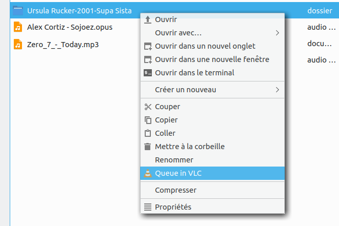
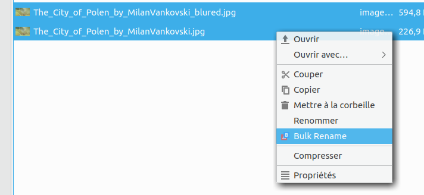
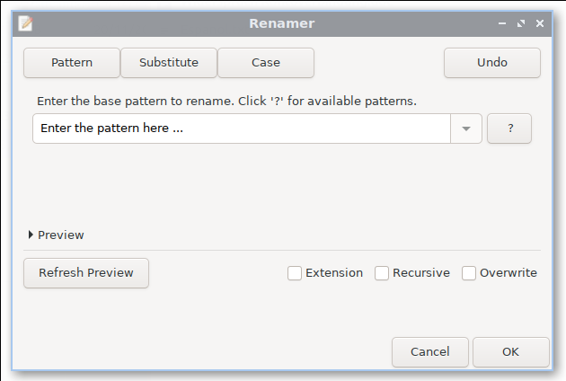

# PCManFM-Qt (and GNOME Nautilus) Context Menu

**Various context menus (i.e. right click menus) for LXQt's file manager ... also should work with Nautilus under GNOME.**

**Create your own (!) actions to speed up repetitive tasks or terminal commands, or simply extend your file manager with what you really need.**

Great Linux distribution: https://lxqt.org/ or https://lubuntu.me/ (which use PCManFM-Qt as file manager)

Copyright © 2020 Andrew Jackson (https://github.com/ceever ... ceever@web.de)

This program is free software; you can redistribute it and/or modify it under the terms of the GNU General Public License as published by the Free Software Foundation; either version 2 of the License, or (at your option) any later version.

This program is distributed in the hope that it will be useful, but WITHOUT ANY WARRANTY; without even the implied warranty of MERCHANTABILITY or FITNESS FOR A PARTICULAR PURPOSE. See the GNU General Public License for more details.

You should have received a copy of the GNU General Public License along with this program; if not, write to the Free Software Foundation, Inc., 51 Franklin Street, Fifth Floor, Boston MA 02110-1301, USA.

---
**SCREENSHOTS:**

**PDF actions:** 

**Enqueue files and folders in VLC:** 

**Mount .iso, .nrg, .bin, .img, .mdf, .sdX, ...** 

**Bulk rename (pattern, substitute, case replacement):** 

---
**BUGS & REQUESTS**

Send me an email or open a ticket on github.

---
**INSTALLATION:**

Put the relevant *.desktop* files (<a href="actions/">actions folder</a> above) onto your system (create folder if missing):
* All users: /usr/share/file-manager/actions/
* Current user: ~/.local/share/file-manager/actions/

Put the associated scripts (<a href="scripts/">scripts folder</a> above) onto your system:
* All users: /usr/share/file-manager/
* Current user: ~/.local/share/file-manager/

**Note**, you might have to render the scripts executable with "chmod +x SCRIPT" before they work. You can actually place them where you want, you just need to make sure to modify the "EXEC=" in the associated *.desktop* file accordingly.

Restart PCManFM-Qt: killall -9 pcmanfm-qt

---
**EXPLANATION & USAGE:**

*.desktop* files are text files under Linux that generally specify a certain program executable. But they are also used for autostart topics (/etc/xdg/autostart) or for file manager actions, often with Nautilus (GNOME) but also with PCManFM-Qt (LXQt).

**Scripts:**
* The scripts are very simple and you can modify them if required. You might even replace programs that are not on your system by your preferred alternative.
* The scripts are needed due to the limitation of *.desktop* files wrt. the "EXEC=" parameter, which do not accept complex scripts.
* **Note**, if you place the scripts under *~/.local/share/file-manager/* you will have to modify the path in the *.desktop* file to your profile path accordingly.

**Dependencies:**

For the specific scripts/context menu to work, they require the following apps/programs:

* PDF: ps2pdf => **ghostscript**
* PDF: gs => **ghostscript**
* PDF: rotate => **pdftk**
* PDF: count => **zenity**, **poppler-utils**
* Mount disk => **udisksctl**
* Bulk rename => **python3**

If not yet installed on your system, install via:
<pre>sudo apt install ghostscript pdftk zenity poppler-utils udisksctl python3</pre>

**Compact PDF actions:**
* These are various ways to make a PDF smaller, with *ps2pdf* being the simplest one.
* *ps2pdf* seems not to change the dpi of pictures, but simply compresses PDFs.
* Instead, *gs/print* produces 300 dpi, *gs/ebook* 150 dpi and *gs/ebook/!* 120 dpi.
* Just try them and take the resulting PDF that best fits your (quality) needs.
* You can even modify the *print* and *ebook* parameter of gs/ghostscript in the script to have different options or names.

**"Queue in VLC":**
* We require two *.desktop* files because it is not possible to filter the selection of files and folders such that the context menu is properly displayed.
* Specifically "MimeTypes=inode/directory;audio/*;video/*;" will only always allow selection of either folders or files, never both at the same time.

**"Bulk rename":**
* The original can be found here: https://github.com/trhura/nautilus-renamer or https://launchpad.net/nautilus-renamer/+download
* I slightly modified it to have an "Overwrite" option included.

**"PDF ..."/menu.desktop:**
* This is the *.desktop* file that creates the submenu for PDF treatment and collects all PDF actions.

**FileManager-Actions (tool):**
* A convenient tool to create context menu actions, in case you are uncomfortable with all the options to put into the *.desktop* (text) file.
* Install: <pre>sudo apt install filemanager-actions</pre>

**Further reading:**
* The *.desktop* file specification in general: https://specifications.freedesktop.org/desktop-entry-spec/latest/ and specifically https://specifications.freedesktop.org/desktop-entry-spec/latest/ar01s06.html
* Context menus (aka custom actions) under LXQt: https://wiki.ubuntuusers.de/PCMan_File_Manager/Benutzerdefinierte_Aktionen/ (German)
* The FileManager-Actions tool: https://gitlab.gnome.org/GNOME/filemanager-actions, https://wiki.ubuntuusers.de/FileManager-Actions/
* How I discovered the convenient sub-menu option: http://bernaerts.dyndns.org/linux/76-gnome/344-nautilus-new-document-creation-menu/ or <a href="sups/bernaerts-nicolas.fr.html" target="_blank">index.html backup</a> (in case the original website is offline)
  
**More examples:**
* https://askubuntu.com/questions/444305/add-open-folder-as-root-to-pcman-file-managers-context-menu
* https://unix.stackexchange.com/questions/430705/add-custom-menu-action-to-caja-file-manager
* https://wiki.manjaro.org/index.php/PCmanFM-Qt
* https://www.linuxquestions.org/questions/bodhi-92/fresh-install-a-couple-of-issues-to-deal-with-4175563768/
* http://cipricuslinux.blogspot.com/2015/06/add-open-folder-as-root-to-pcman-file.html
* https://ubuntuplace.info/questions/344492/add-a-new-nautilus-context-menu-action-without-using-nautilus-actions (French)
